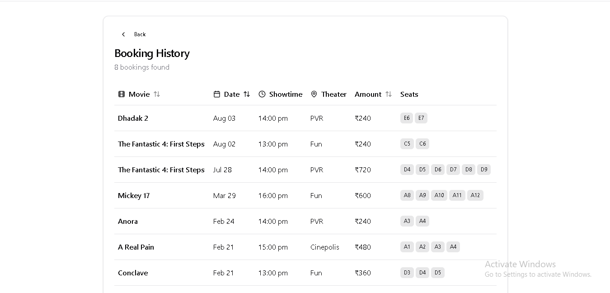

# 🎟️ Realtime Movie Ticket Booking App

A modern, high-performance movie ticket booking platform with real-time seat locking and optimized user experience.

## 🔗 Live Demo

[View Deployed Site](https://realtime-movie-ticket-booking-app.vercel.app/)

## 🛠️ Tech Stack

- **Frontend**: React.js, TypeScript, Tailwind CSS
- **State Management & Data**: React Query
- **Backend & Realtime DB**: Firebase (Authentication + Firestore + Realtime Database)
- **Performance**: Lazy loading, code splitting, debouncing, infinite scrolling

---

## ✨ Features

- 🔒 **Real-Time Seat Locking**  
  Prevents double bookings by locking selected seats instantly using Firebase Realtime DB.

- 🔍 **Debounced Movie Search**  
  Reduces unnecessary API calls by 50% through smart input handling.

- ♾️ **Infinite Scrolling**  
  Smoothly loads more content as you scroll, reducing initial load time and enhancing UX.

- ⚡ **Performance Optimizations**

  - Lazy-loaded components and code splitting: ⬇️ 30% faster initial load
  - Efficient server interactions with React Query
  - Reduced server load by 15%

- 🎨 **Responsive & Minimal UI**  
  Built with Tailwind CSS for a clean and responsive user experience.

---

## 📸 Screenshots

